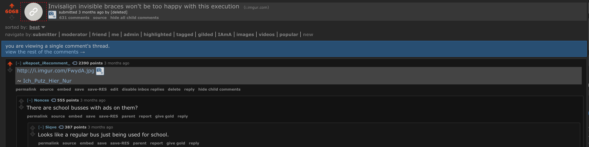

# uRepost iRecomment
Automated commenting bot on <a href="https://www.reddit.com" alt="Reddit">Reddit</a> reposted threads using <a href="http://karmadecay.com/" alt="Karma Decay">Karma Decay</a>.<br>The bot process works as follows: <br>
<ol>
<li> Looks for rising reposted links on Reddit based on a list from: <a href="http://redditmetrics.com/top" alt="redditMetrics">redditMetrics</a> </li>
<li> Aquires all source/reposted threads of that submission </li>
<li> Takes the top thread and copy's the highest upvoted comment </li>
<li> Posts comment on current reposted thread with permalink back to the original highest comment</li>
</ol>

### Example 1


### Example 2


### Why???
This was primarily an experimental project. I wanted to see how Reddit would react to reposted comments. The bot recieved 25k comment karma in 3 days. Later the bot got shadowbanned for repeat posting on loads of subreddits. It could use some refinement and probably a delay.

Since i'm not trying to steal comments the bot refers back to the original comment with a permalink.

### Comment setup
Right now the bot uses the following comment scheme:

```bash
"Comment from original top comment."
~ /u/reddit user
```

With the file "illegalPhrases.txt" i'll filter out all the phrases that I don't want to see in a comment. For example it's a bad shitty thing to post comments that are deleted (often are topcomment) so i'll filter those. If the highest comment comes from a deleted account i'll filter that also since there is no way to credit the OP.

Aside from that the script is also timing posts to recent ones. There is no point in posting a comment in a thread that is 20hours old.

### Working with Karma Decay
I used kdapi as the base for my Karma Decay script. I fixed many issues with the webpage parsing. Karma Decay also blocked many US AWS ips, so I used a proxy.

### Resources Used
- <a href="https://github.com/ethanhjennings/karmadecay-api" alt="kdapi">kdapi</a>
- <a href="https://github.com/SmBe19/praw-OAuth2Util" alt="praw-OAuth2Util">praw-OAuth2Util</a>
- <a href="https://www.mongodb.com/" alt="praw-OAuth2Util">MongoDB</a>
- <a href="https://www.digitalocean.com/" alt="digitalocean">digitalocean</a>
